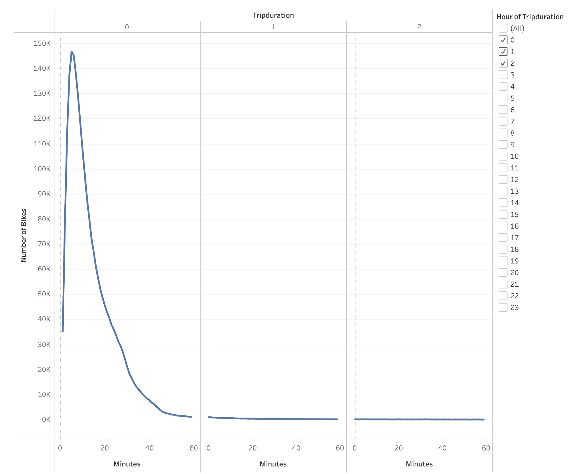
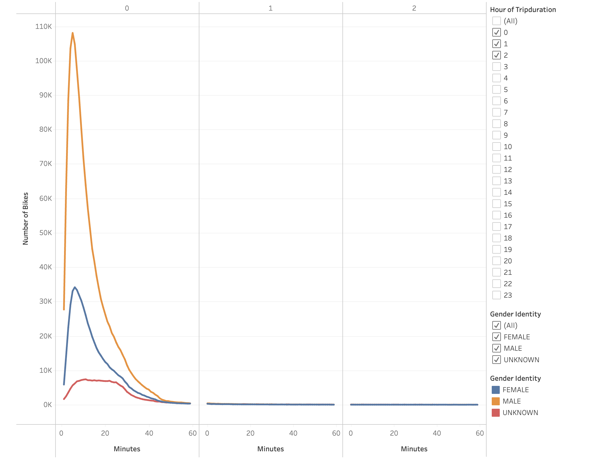
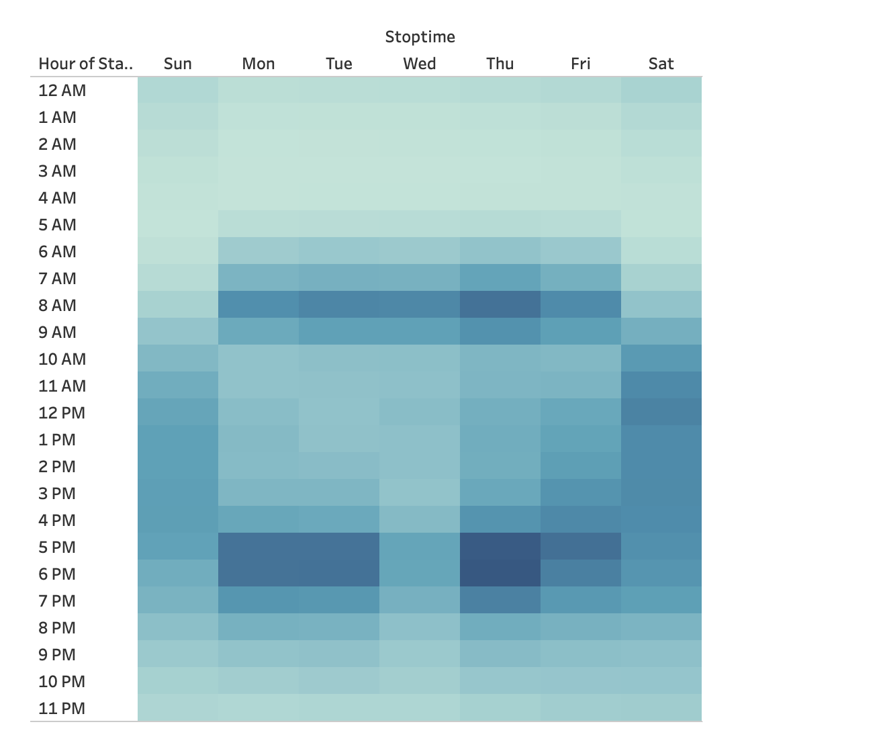
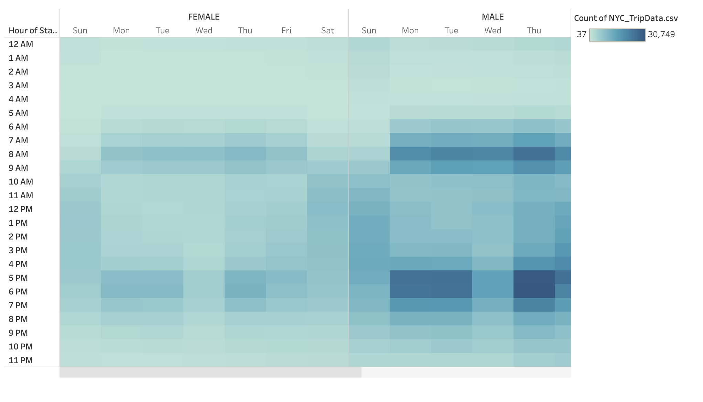
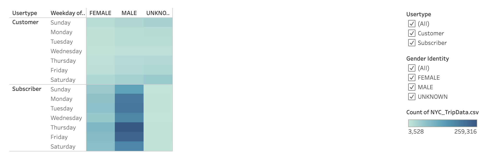
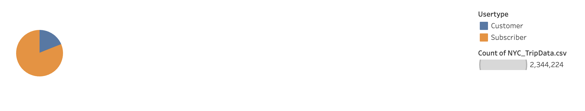
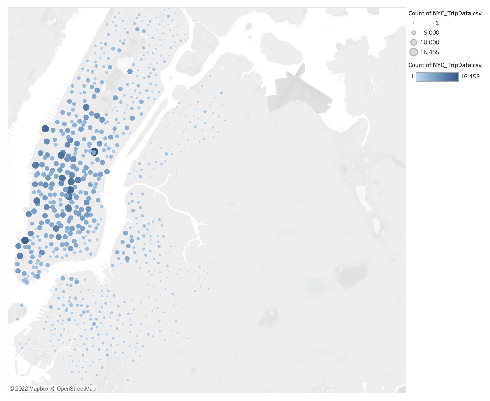

#  NYC Trip Data 

[link to dashboard](https://public.tableau.com/app/profile/jovan.simmons/viz/NYCTripDataChallenge/NYCTripDataChallenge "link to dashboard")

## Overview of the analysis:

 
## Results:
 * 

## Summary:
* Provide a high-level summary of the results and two additional visualizations that you would perform with the given dataset.

In this visualization, we see  the length of time that bikes are checked out for all riders.

 

In this visualization, we see  the length of time that bikes are checked out for each gender.

 

In this visualization, we see the number of bike trips by weekday for each hour of the day as a heatmap.

 

In this visualization, we see the number of bike trips by gender for each hour of each day of the week as a heatmap.

 
   
In this visualization, we have a heatmap that shows the number of bike trips broken down by gender for each day of the week by each Usertype.

 

This pie chart gives the breakdown of rider types in New York City, which will help us predict the customer breakdown in Des Moines

 

This map shows the Top Bike Stations in the City for Starting a Journey

 

* Additional visualizations that I would like to perform with the dataset
**
**
